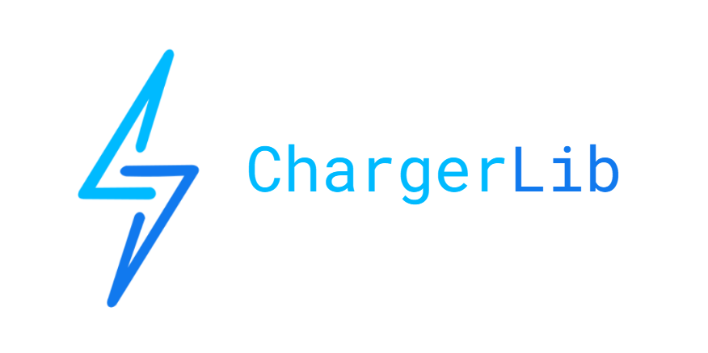

# ChargerLib

ChargerLib is a Java-based FRC library. Its goal is to provide a well-structured codebase for every aspect of robot functionality that does not directly depend on the game rules in a given season. 

The library contains the following functionality:

- Wrapper classes for hardware such as motors, sensors etc. that allow for generalized hardware usage without requiring junior members to understand vendor-specific hardware APIs

- A generic roller subsystem that can be subclassed for any intake, transfer, or flywheel-like mechanism, including those involving multiple motors and/or a digital sensor, along with a command for controlling it
  
- A generic swerve drivetrain based on the SDS library that can be configured with varying chassis parameters, along with a generic drive command for controlling it and utility classes that allow for intuitive drivetrain configuration and offset calibration

- A generic controller configuration which  provides driving controls and gyro/odometry reset buttons and can be subclassed for additional user inputs

- (TODO) Commands for quickly testing and modifying PID profiles without having to reupload code after every modification 

- (TODO) Generic classes for limelights and robot odometry

## Todo

questions:

- is maxVoltage global or just drivetrain?
- is setReverseLimitSwitch reversed or does the value have to be negative?
- is setVelocity RPM or RPS?

todo:
- add reverseJoystick parameter for controls config
